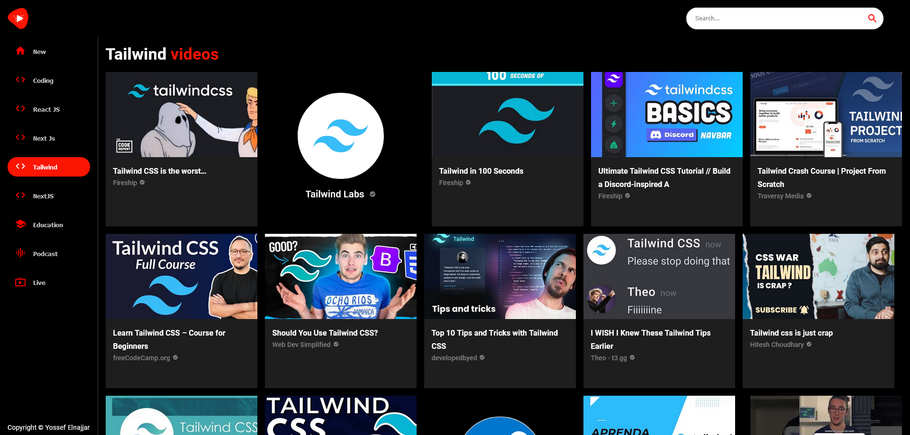

# YouTube Clone with React.js



Welcome to the YouTube Clone project, built with React.js! This application is designed to replicate the popular video-sharing platform YouTube, offering a modern UI/UX and a responsive design. You can access the live version of this project [here](https://yossef-youtube.netlify.app/).

## Technologies Used

- **HTML:** Used to create the structure of the web pages.
- **CSS:** Utilized for styling the components and achieving a modern look.
- **JavaScript:** Employed for interactivity and dynamic functionality.
- **React.js:** The core framework used for building the application.
- **React Router:** Facilitates navigation within the app.
- **MUI (Material-UI):** Provides pre-designed UI components for a polished interface.
- **Rapid API:** Used for fetching data, such as video information.

## Features

- **Modern UI/UX:** The application boasts a contemporary design that closely resembles the real YouTube interface.
- **Semantic HTML5 Markup:** Ensures accessibility and search engine optimization.
- **CSS Flexbox:** Used for flexible and responsive layout design.
- **Responsive Design:** The app adapts to various screen sizes, making it accessible on both desktop and mobile devices.
- **React Component Methodology:** The project is structured using React components for modularity and maintainability.
- **Refs and Context API:** These React features are employed to manage state and handle references efficiently.
- **Advanced File Structure:** The project follows a well-organized file structure to enhance code readability and scalability.

## How to Use

To run this project locally, follow these steps:

1. Clone the repository to your local machine.

```bash
git clone https://github.com/your-username/youtube-clone.git
```

2. Navigate to the project directory.

```bash
cd youtube-clone
```

3. Install the dependencies.

```bash
npm install
```

4. Start the development server.

```bash
npm start
```

The app will be available at `http://localhost:3000/`.

## Feedback and Contributions

We welcome any feedback or contributions to improve this YouTube Clone project. If you encounter issues or have ideas for enhancements, please submit them through the GitHub repository's issue tracker.

Thank you for checking out our YouTube Clone project! We hope you enjoy using it and find it informative for your React.js development journey.
